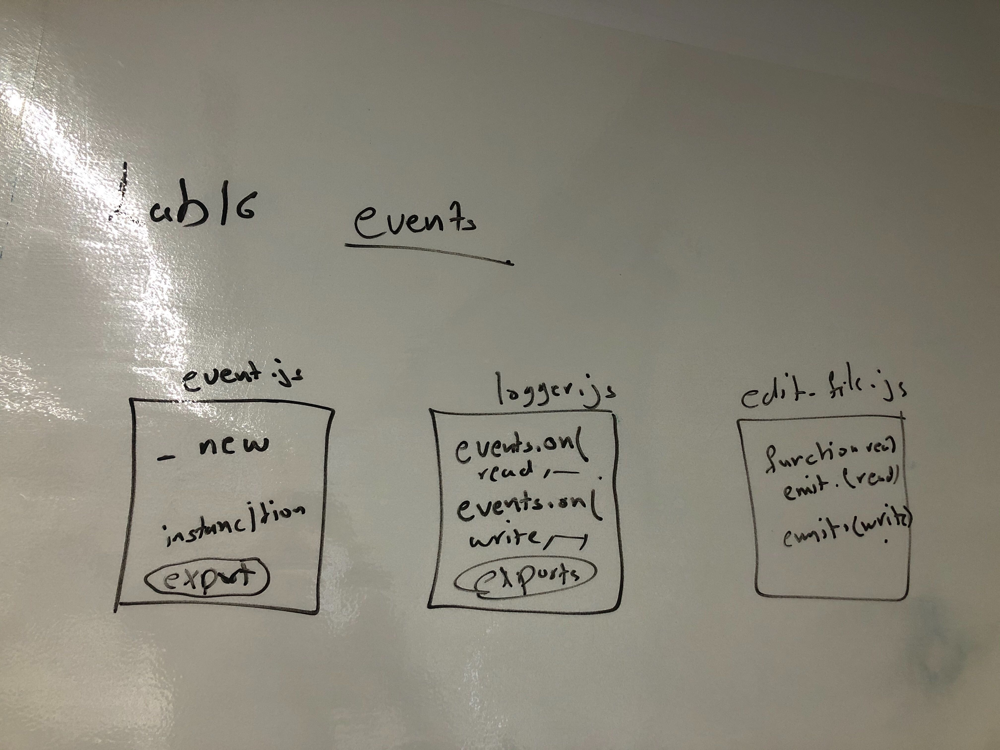

# lab-16-event-driven-applications

# LAB - Class 16

## Event Driven Applications

### Author: Muna and Mai 

### Links and Resources

- [submission PR](https://github.com/401-advanced-javascript-muna/lab-16-event-driven-applications/pull/1)
- [ci/cd](https://github.com/401-advanced-javascript-muna/lab-16-event-driven-applications/actions) (GitHub Actions)

#### How to initialize/run your application (where applicable)

- node edit-file.js

#### Tests

#### UML

Link to an image of the UML for your application and response to events

